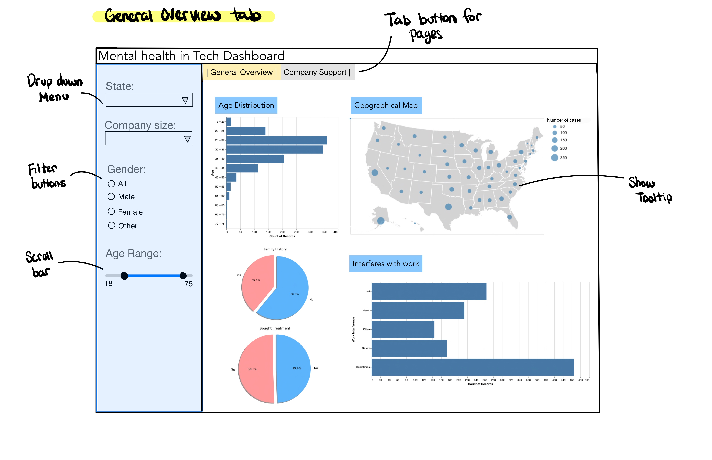
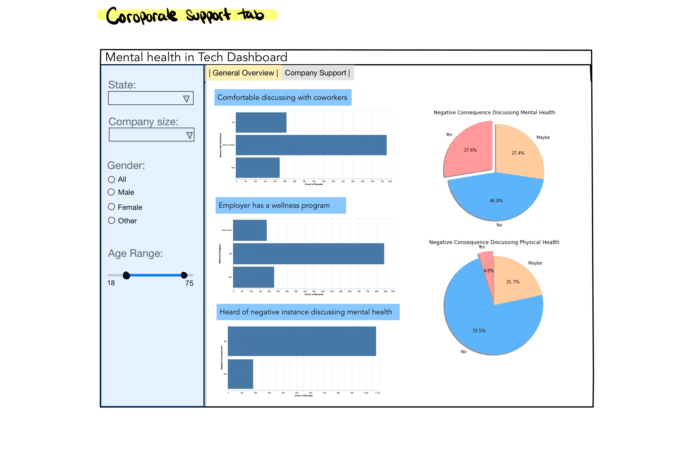

# Mental Health in Tech Industry reporting app
* authors: Mitchie Zhao, Jordon Lau, Kaicheng Tan, Daniel Ortiz

A data science project for DSCI 532 (Data Visualization II); a course in the Master of Data Science program at the University of British Columbia. You can find the reporting app [here](https://dsci532-viz-g8.herokuapp.com/).

## About

Alex is a policy maker working for the government of the United States. He wants to understand if mental health has become a major problem among employees from tech companies. He wants to be able to explore the [Mental Health in Tech Survey dataset](https://www.kaggle.com/osmi/mental-health-in-tech-survey) visually to compare the general situations of mental health issues for people in tech, both geographically and demographically, and find out the most relevant factors that can justify his intention to improve current labor contract policies.

## App description

The Mental Health in Tech Industry reporting app contains two tabs. The landing page (“General overview tab”) shows the ‘Age Distribution’ histogram, interactive ‘Geographical Map’ of the United States, two pie charts corresponding if employees have family history of mental illness and if they have sought treatment, and a categorical histogram that corresponds to their beliefs about mental health conditions interfering with their work. From a multiple dropdown menu, users can filter the geographically location by ‘State’. From a set of filtering buttons, the user can select the ‘Gender’ and from a scroll bar, the user can define the ‘Age range’. Finally, the user is also able to filter the company size (i.e. small, medium, large) by their number of employees through a dropdown menu. The second tab shows the “Corporate Support” where you can find histograms and pie charts. The histograms relate to whether the employers have a mental health program, how comfortable the employees feel about discussing their mental health issues with coworkers, and if they have heard of negative consequences when discussing these issues. The pie charts will allow the user to compare the employees feeling about negative consequences related to mental health and physical health conditions. Every plot will automatically update taking into consideration the filtering options that the user has chosen. For example, if the user selects ‘all states’, ‘Female’ and ‘18-75’, the plots in both tabs will correspond only to the observations that match all of the given criteria.

## Dependencies

altair==4.1.0
dash==1.18.1
dash-bootstrap-components==0.11.1
pandas==1.1.5
vega_datasets
plotly==4.14.3
gunicorn

## App sketch

